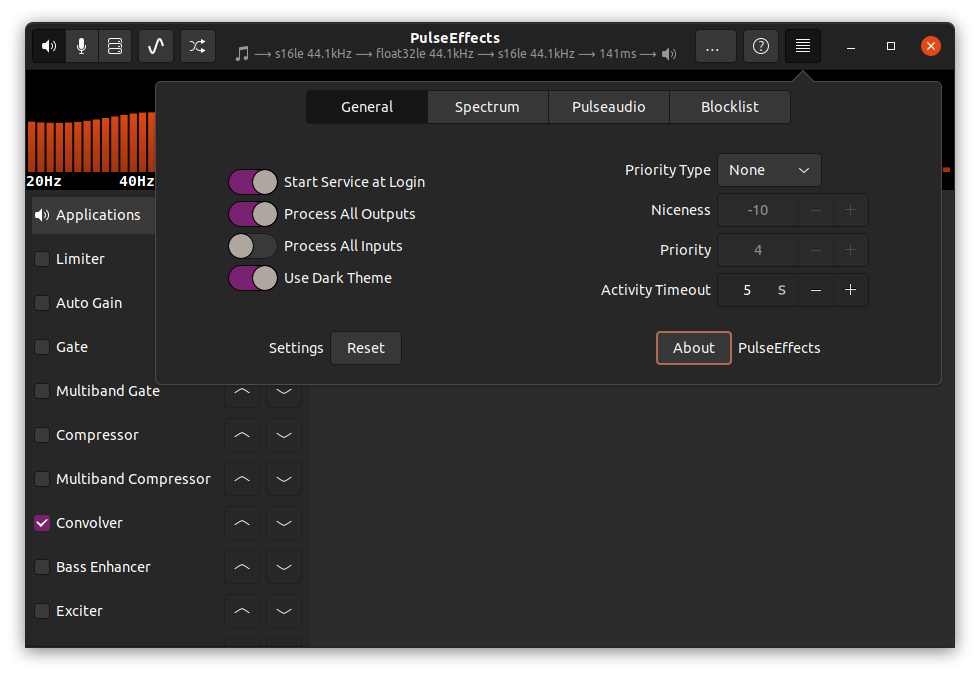
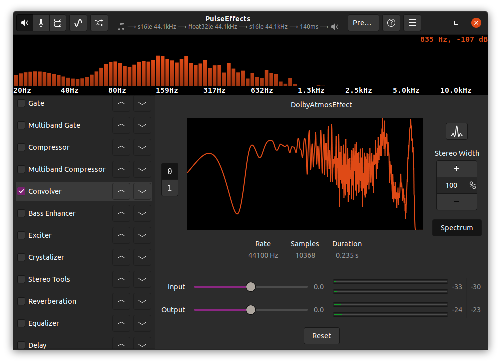
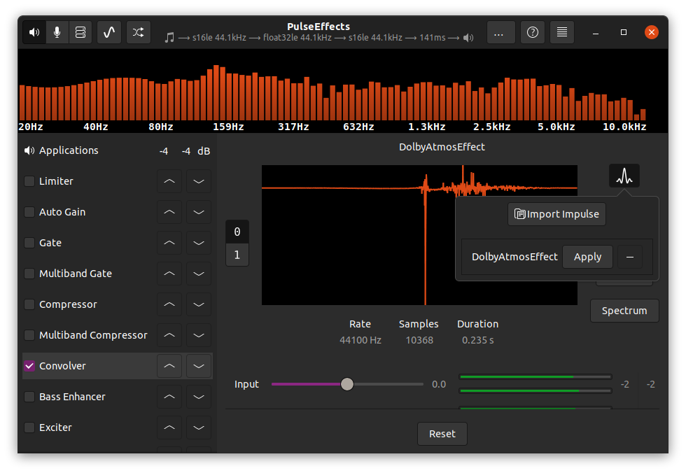

# Linux Dolby Atmos

a guide to enable Dolby Atmos on linux.

## Installation 

### i. Downloading Effect 
First lets get our `DolbyAtmosEffect.irs` file.

you can download it by cloning the repo
`https://github.com/adgsenpai/LinuxDolbyAtmos`

or

you can download the raw file only 
`https://raw.githubusercontent.com/adgsenpai/LinuxDolbyAtmos/main/DolbyAtmosEffect.irs`

### ii. Downloading `Pulse Effects` now called `Easy Effects`.

Installing Pulse Effects

Methods

a) Easy Way

go to `https://pkgs.org/download/pulseeffects`

Select your distro and then `download` and `install` the `PulseEffect` package for your distro.

b) Complex Way

go to `https://github.com/wwmm/easyeffects` and compile from source.

this wiki will help you with the complex way

`https://github.com/wwmm/easyeffects/wiki/Installation-from-Source`

### iii. Configuring Pulse Effects with the plugin file

- Launch the `PulseEffects App`

First thing you are going to do is allow the service to run when system boots you can do this in the `settings` by clicking on the hamburger icon as illustrated by this photo.

Enable the Dolby Atmos Effect

and the left menu you see `Applications` or `Limiter` thats the menu im talking about. Scroll down until you see the `Convolver Effect` once there

You will see this screen

now click on the `wave icon` and `import your effect` to the directory of `DolbyAtmosEffect.irs` and `apply it` then `disable` and `enable` `Convolver`
 
This image will help you out

Enjoy Dolby Atmos for Linux :-)